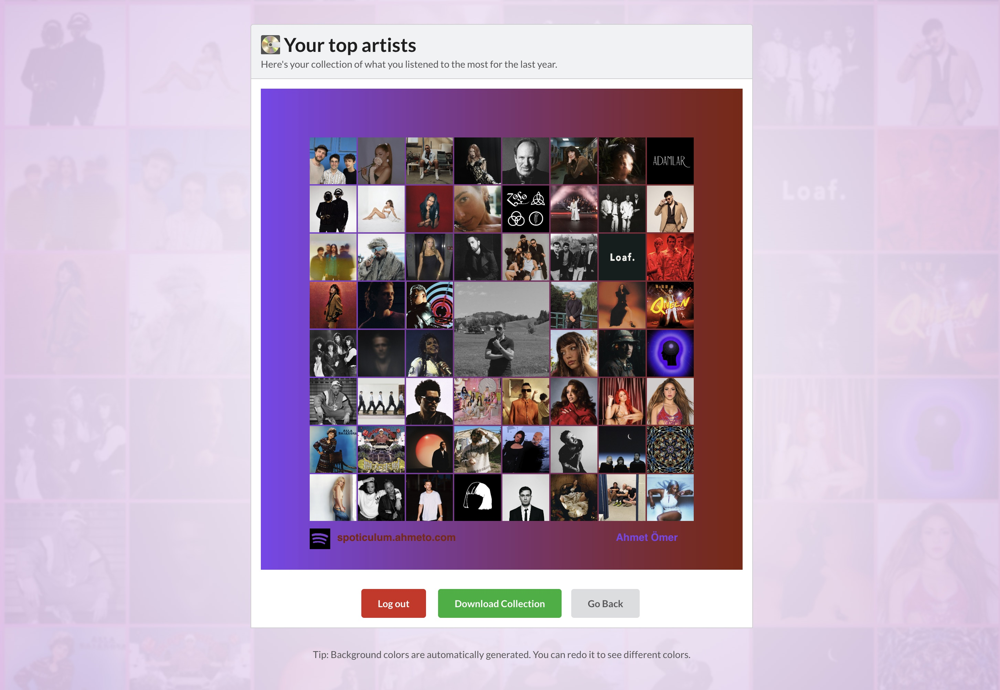

# Spoticulum

Spoticulum is an open-source Spotify collection-image maker. Connect a Spotify account, choose top artists or top tracks, and download a shareable image assembled in the browser.

The app is built with React, Vite, TypeScript, and an Express API. Spotify OAuth
tokens stay on the server in an HTTP-only session; the client talks to same-origin
`/api/*` routes and never receives Spotify access or refresh tokens.



## Tech Stack

- React 19 and Vite
- TypeScript
- Express 5
- Spotify Web API
- Vitest, Node test runner, and Playwright
- Docker-ready production build

## Requirements

- Node `24.21.0` from `.nvmrc`
- npm `11.x`
- A Spotify Developer application

Create a Spotify app in the
[Spotify Developer Dashboard](https://developer.spotify.com/dashboard) and add
this local redirect URI:

```text
http://127.0.0.1:8888/api/logged
```

Use `127.0.0.1`, not `localhost`, so the callback exactly matches the local
configuration.

## Quick Start

```sh
nvm install
nvm use
npm --prefix client ci
npm --prefix server ci
cp server/.env.example server/.env
```

Edit `server/.env` with your Spotify credentials:

```sh
CLIENT_ID=your-spotify-client-id
CLIENT_SECRET=your-spotify-client-secret
SESSION_SECRET=generate-a-long-random-session-secret
REDIRECTURI=http://127.0.0.1:8888/api/logged
CLIENT_REDIRECTURI=http://127.0.0.1:3000/
```

Start the app:

```sh
npm run dev
```

Open `http://127.0.0.1:3000`.

The API runs on `http://127.0.0.1:8888`, and Vite proxies `/api` to it during
development.

## Environment Variables

Server runtime variables:

| Name | Required | Description |
| --- | --- | --- |
| `CLIENT_ID` | Yes | Spotify application client ID. |
| `CLIENT_SECRET` | Yes | Spotify application client secret. Keep this server-side only. |
| `SESSION_SECRET` | Yes | Long random value used to sign session cookies. |
| `REDIRECTURI` | Yes | Spotify OAuth callback URL, for example `http://127.0.0.1:8888/api/logged`. |
| `CLIENT_REDIRECTURI` | Yes | App URL to return users to after OAuth. |
| `PORT` | No | API port. Defaults to `8888`. |
| `COOKIE_SECURE` | No | Set to `true` to force secure cookies outside production. |

Client build variable:

| Name | Required | Description |
| --- | --- | --- |
| `VITE_GA` | No | Optional Google Analytics measurement ID. Analytics remains disabled until the user consents. |

Never put `CLIENT_SECRET`, `SESSION_SECRET`, Spotify access tokens, or Spotify
refresh tokens in client environment variables.

## Scripts

Run these from the repository root:

```sh
npm run dev
npm run typecheck
npm run lint
npm test
npm run build
npm run verify
```

`npm run verify` runs typecheck, lint, tests, format checks, and the production
build.

Useful package-specific commands:

```sh
npm --prefix client run test:e2e
npm --prefix client run format:check
npm --prefix server run format:check
npm --prefix client audit
npm --prefix server audit --omit=dev
```

Install Playwright's Chromium browser before the first E2E run:

```sh
cd client
npx playwright install chromium
npm run test:e2e
```

The E2E tests use mocked Spotify responses, so they do not require a real Spotify
account.

## Production

Build and run locally:

```sh
npm --prefix client ci
npm --prefix server ci
npm --prefix server run build
cd server
NODE_ENV=production npm start
```

In production:

- Serve the app and API from the same HTTPS origin.
- Set `REDIRECTURI` and `CLIENT_REDIRECTURI` to that same origin.
- Add the production `REDIRECTURI` to the Spotify Developer Dashboard.
- Keep `CLIENT_SECRET` and `SESSION_SECRET` as runtime secrets.
- Use one replica unless you add a shared session store; in-memory sessions are
  cleared on restart and are not shared across containers.

The included Dockerfile builds the client and server into a single production
image:

```sh
docker build -t spoticulum .
docker run --env-file server/.env -p 8888:8888 spoticulum
```

Build-time analytics can be supplied with:

```sh
docker build --build-arg VITE_GA=G-XXXXXXXXXX -t spoticulum .
```

## Security and Privacy Notes

- Spotify tokens are stored only in the server session.
- Session cookies are HTTP-only and signed.
- Production redirect URLs must use HTTPS and share the same origin.
- CORS only allows the configured app origin and local development origins.
- The generated image is assembled in the browser and is not uploaded by the app.

## License

Spoticulum is released under the [MIT License](LICENSE).
